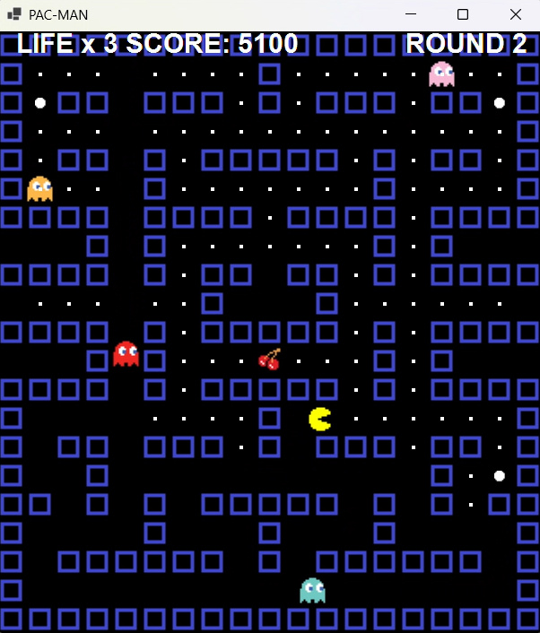

# パックマン C#版
ナムコのアーケードゲーム「パックマン」をC#とWinFormsを使用して再現してみました。

以前Javaでも同様のゲームを制作しましたので、操作方法やスコア表、主な内容については下記リンクをご参照ください ↓

https://github.com/motomasMINO/PacMan-Java



## 概要
- **ゴーストに触れずにすべてのエサを食べると次のラウンドへ**
- **パワーエサを食べるとゴーストがイジケ状態になり、一定時間食べることが可能**
- **一定数のエサを食べるとフルーツが出現**
- **サウンドエフェクト & BGM**
- **ランダムに移動するゴースト**
- **1UPシステム(ボーナススコアでライフが1追加)**
- **ゲームオーバー後にいずれかのキーを押すとリスタート**

## 🛠️ 使用技術
- **言語・フレームワーク :** C#(.NET Framework /  .NET 6+)
- **GUI :** Windows Forms
- **サウンドライブラリ :** [NAudio](https://github.com/naudio/NAudio)

## 💻 実行方法
1. **必要環境**
- Visual Studio 2022 以降
- .NET Framework または .NET 6+

2. **リポジトリのクローン(ダウンロード)**
   
   ターミナルまたはコマンドプロンプトで以下を実行:
   ```sh
   dotnet run --project PacMan
   ```

## 📜 ライセンス
このプロジェクトはMIT Licenseのもとで公開されています。

## 📧 お問い合わせ
- Github: motomasMINO
- Email: yu120615@gmail.com

  バグ報告や改善点・機能追加の提案はPull RequestまたはIssueで受け付けています!
  